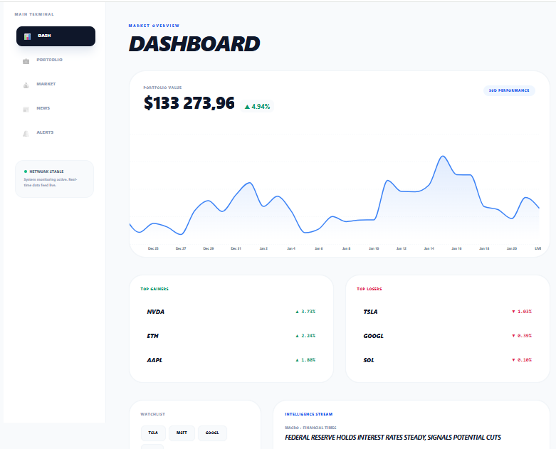
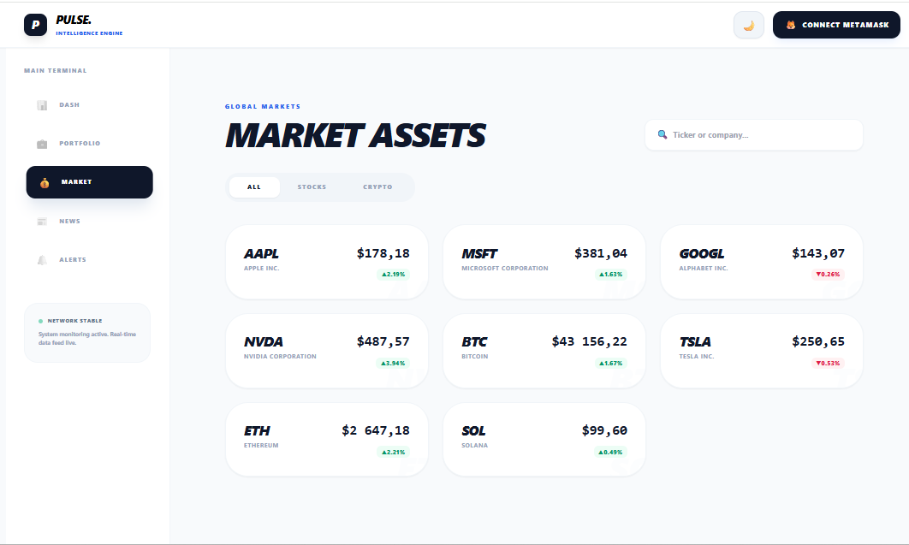
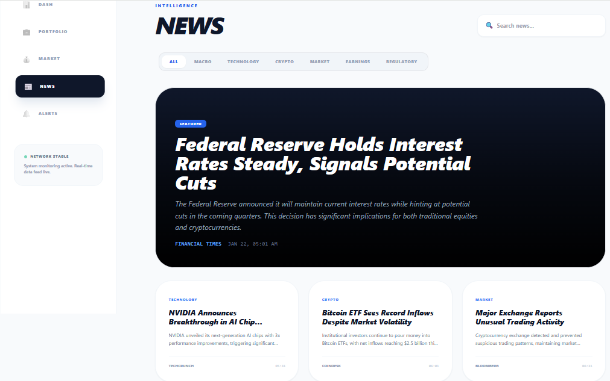
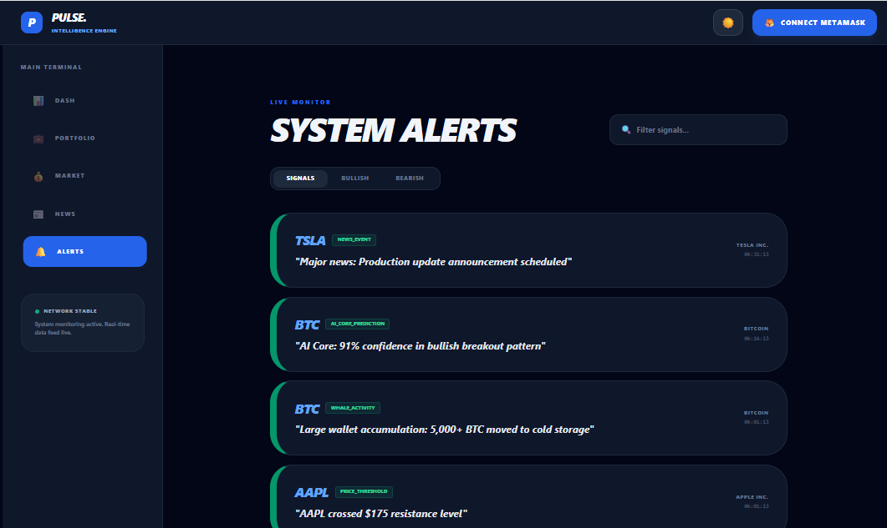
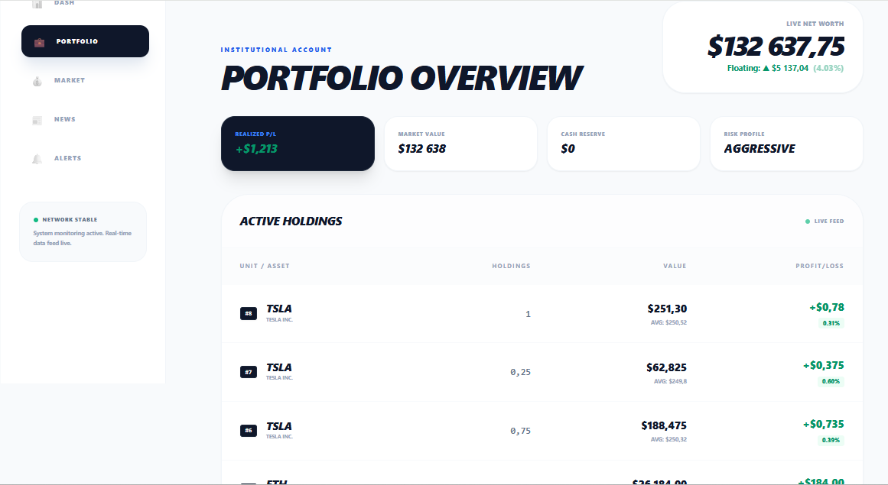
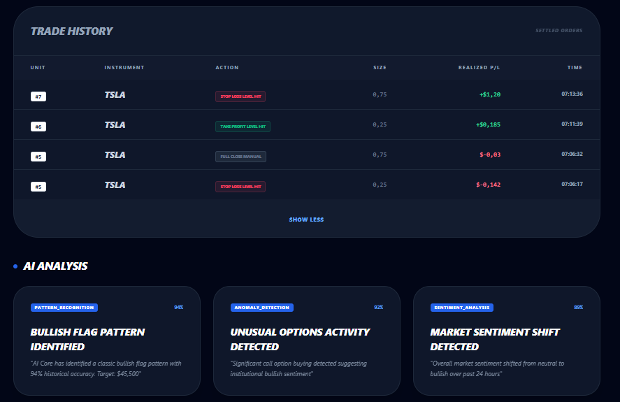
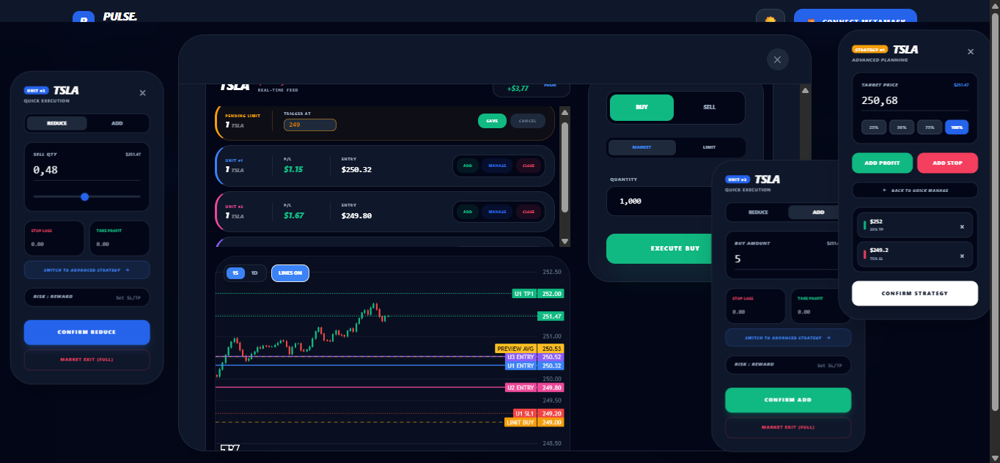

[](https://pulsenow-io-frontend-connect-2r0wyxsml-jan-pivonkas-projects.vercel.app/)
[](https://react.dev/)
[](https://www.tradingview.com/lightweight-charts/)

# 💹 PulseNow – Advanced Real-Time Trading Platform

## 📝 Project Context and Goal

PulseNow is an **advanced frontend trading platform** designed for real-time monitoring and simulated trading of financial assets (stocks and cryptocurrencies).

The project was originally started as a **frontend assignment** for a company that provided a fully functional backend API. The initial task was limited to implementing basic **Dashboard** and **Assets** pages. However, due to my long-term involvement in trading, I significantly expanded the scope of the frontend beyond the original requirements.

The application evolved into a **complex trading terminal frontend**, focused on:

* real-time market visualization,
* high-frequency state updates,
* advanced portfolio and P/L calculations,
* and interactive chart-based order management.

> **Important note:** The application currently runs **entirely on mocked market and trading data**. The original backend (Railway) is no longer required for the application to function.

---

## 🚀 Live Demo

**Frontend (Vercel):**
👉 [https://pulsenow-io-frontend-connect-2r0wyxsml-jan-pivonkas-projects.vercel.app/](https://pulsenow-io-frontend-connect-2r0wyxsml-jan-pivonkas-projects.vercel.app/)

**Backend:**
❌ Not required – the application uses **local mock data** for all market feeds and trading operations.

---

## 🏗️ Application Architecture

### 🔹 Frontend

The application is built with **React 18** and designed with a strict separation between **business logic** and **UI rendering**.

Core architectural principles:

* **Feature-first component structure**
* **Application logic extracted into custom hooks** (`useRealTimeData`, `useTrading`, `useTradingLogic`)
* **UI components focused purely on rendering**
* **Predictable state transitions**, even under high-frequency updates
* **Dynamic TradingChart** with multi-layer rendering:

  * entries
  * take-profits (TP)
  * stop-losses (SL)
  * limit orders

---

## 🗂️ Pages

The frontend is divided into the following route-level pages:

* **Dashboard** – portfolio overview, performance tracking, market heatmap
* **Assets** – asset explorer, trending instruments, realized / unrealized P&L
* **Portfolio** – active units, trade history, detailed position management
* **News** – market news feed (static / mock-driven)
* **Alerts** – real-time alerts feed with scoring and filtering

---

## 🧩 Key Components

* **TradingChart.tsx** – core visualization layer using *Lightweight Charts*, rendering:

  * individual units with dynamic P/L
  * entry, TP, SL, and limit orders
  * preview average price line when scaling into positions

* **Modals** – advanced trading workflows:

  * `AdvancedPositionModal`
  * `MarketOrderModal`
  * `PositionManagerModal`
  * `DeleteConfirmationModal`
  * `TradeSuccessModal`

* **Shared UI modules** – Layout, ThemeToggle, MetaMaskButton, PageHeader, SearchInput

---

## 🔌 State & Services

* **TradingContext** – global state for positions, pending orders, and execution logic
* **useRealTimeData** – simulated live feed for stocks and crypto
* **useTradingLogic** – core calculations:

  * floating P/L
  * average price
  * preview execution lines

---

## ✨ Key Features

* **Real-Time Portfolio Updates** – floating P/L recalculated on every tick
* **Dynamic Average Price Calculation** – visualized directly on the chart
* **Order Management** – edit / cancel limit orders from the chart UI
* **Unit-Based Tracking** – each buy tracked as an individual unit
* **Alerts Feed** – bullish / bearish scoring with multi-layer filters
* **Responsive Layout** – dark / light mode, sticky sidebars, mobile-friendly layout

---

## ⚠️ Current Limitations

* Trading supports **buy / long positions only**
* No backend persistence (state is reset on refresh)
* Authentication and multi-user features are not implemented

These limitations are **intentional** and reflect the project’s focus on **frontend architecture and trading logic**, not backend infrastructure.

---

## 🛠️ Tech Stack

* **Frontend:** React 18, JavaScript / TypeScript
* **State Management:** Context API (`TradingContext`, `ThemeContext`)
* **Visualization:** Lightweight Charts (price charts), Recharts (analytics)
* **Styling:** Tailwind CSS + custom CSS
* **Infrastructure:** Vercel (static frontend hosting)

---

## 📂 Project Structure

```text
src/
├─ components/      # UI modules (TradingChart, Modals, MetaMaskButton)
├─ pages/           # Route-level pages (Dashboard, Alerts, Assets, Portfolio, News)
├─ services/        # Business logic (TradingContext, useRealTimeData, useTradingLogic)
├─ hooks/           # Custom hooks for monitoring and UI logic
└─ app/             # Global layout and routing

public/
├─ icons/           # Logos and icons
└─ images/
   └─ screenshots/  # Screenshots for README and documentation
```

---

## 📸 Screenshots

### Dashboard – Light



### Market – Light



### News – Light



### Alerts – Dark



### Portfolio – Active Holdings (Light)



### Portfolio – Trade History (Dark)



### Chart Modals – Dark



---

## ⚙️ Local Development

```bash
npm install
npm run dev
```

The application runs **fully offline using mocked data**. No backend or API keys are required.

---

## 📈 Roadmap and Future Improvements

* **Short-selling logic** – enable short positions
* **Advanced analytics** – RSI, moving averages, indicators
* **Backend integration** – persistence of portfolios and orders
* **Authentication / authorization** – multi-user roles
* **Collaborative trading views** – shared portfolios
* **Optimistic UI updates** with server reconciliation

---

## 👤 Author

**Peony 🌸**
GitHub: [https://github.com/peony](https://github.com/peony)
